# ripestat-cli

一個功能完整的 Go 語言命令列工具，提供 RIPEstat API 的強大包裝器。可直接從終端查詢 ASN（自治系統號碼）、IPv4 和 IPv6 位址的詳細資訊，並以精美格式化的方式顯示結果。

[](https://golang.org)
[](LICENSE)
[](#測試)

## 功能特色

- **🔍 多重輸入支援**：可在單一指令中同時查詢多個 ASN、IPv4 和 IPv6 位址
- **🤖 智慧型辨識**：自動將輸入分類為 ASN、IPv4 或 IPv6
- **📊 豐富資訊**：提供完整的資料，包括：
  - ASN 概覽、持有者資訊和註冊機構詳細資料
  - 區域網際網路註冊機構 (RIR) 分配資料
  - BGP 路由一致性和前綴資訊
  - 地理位置資料，包含城市/國家詳情
- **📋 清晰表格輸出**：專業的格式化表格，便於閱讀
- **⚡ 快速效能**：並發 API 呼叫，達到最佳速度
- **🧪 完整測試**：全面的測試套件，確保可靠性

## 快速開始

```bash
# 複製並建構
git clone https://github.com/cmingou/ripestat-cli.git
cd ripestat-cli
go build -o ripestat main.go

# 同時查詢多個資源
./ripestat 8.8.8.8 13335 2001:4860:4860::8888
```

## 安裝方式

### 從 GitHub Releases 安裝（推薦）

從 [Releases 頁面](https://github.com/cmingou/ripestat-cli/releases)下載適合您平台的最新預編譯二進位檔案：

**macOS:**
```bash
# Intel Mac (x86_64)
curl -L https://github.com/cmingou/ripestat-cli/releases/latest/download/ripestat_Darwin_x86_64.tar.gz | tar xz
sudo mv ripestat /usr/local/bin/

# Apple Silicon (M1/M2/M3 - arm64)
curl -L https://github.com/cmingou/ripestat-cli/releases/latest/download/ripestat_Darwin_arm64.tar.gz | tar xz
sudo mv ripestat /usr/local/bin/
```

**Linux:**
```bash
# x86_64 (Debian, Ubuntu, CentOS 等)
curl -L https://github.com/cmingou/ripestat-cli/releases/latest/download/ripestat_Linux_x86_64.tar.gz | tar xz
sudo mv ripestat /usr/local/bin/

# ARM64 (Raspberry Pi, ARM 伺服器等)
curl -L https://github.com/cmingou/ripestat-cli/releases/latest/download/ripestat_Linux_arm64.tar.gz | tar xz
sudo mv ripestat /usr/local/bin/
```

### 從原始碼安裝

```bash
git clone https://github.com/cmingou/ripestat-cli.git
cd ripestat-cli
make install
```

### 開發建構

```bash
# 為目前平台建構
go build -o ripestat main.go

# 為所有平台建構
make all

# 為特定平台建構
make darwin  # macOS
make linux   # Linux
```

## 使用方法

工具接受多個參數並自動偵測其類型：

```bash
# 同時查詢多個資源
./ripestat 8.8.8.8 13335 2001:db8::1

# 查詢個別資源
./ripestat 8.8.8.8                    # IPv4 位址 (Google DNS)
./ripestat 13335                       # ASN (Cloudflare)
./ripestat 2001:4860:4860::8888       # IPv6 位址 (Google DNS)
./ripestat 1.1.1.1 15169 8.8.8.8      # 混合輸入類型
```

### 輸出範例

#### ASN 資訊
```
## ASN
   AS   | COUNTRY | RIR  |    AS NAME     
--------|---------|------|----------------
  13335 | US      | ARIN | CLOUDFLARENET  
```

#### IPv4 資訊
```
## IPv4
    IP    | LOCATION |   PREFIX   | IN BGP | AS NUMBER |           AS NAME             
----------|----------|------------|--------|-----------|-------------------------------
  8.8.8.8 | US       | 8.8.8.0/24 | true   |     15169 | GOOGLE - Google LLC           
```

#### IPv6 資訊
```
## IPv6
                   IP          | LOCATION |     PREFIX     | IN BGP | AS NUMBER |       AS NAME        
-----------------------|----------|----------------|--------|-----------|----------------------
  2001:4860:4860::8888 | US       | 2001:4860::/32 | true   |     15169 | GOOGLE - Google LLC   
```

## 架構設計

<div align="center">
  
</div>

工具採用清晰的模組化架構：

1. **輸入處理**：CLI 參數被解析並按類型分類
2. **類型偵測**：自動識別 ASN、IPv4、IPv6 或無效輸入
3. **API 整合**：統一的客戶端介面連接多個 RIPEstat 端點
4. **資料處理**：結構化處理 API 回應
5. **輸出格式化**：專業的表格格式化用於終端顯示

## API 整合

此工具整合了多個 RIPEstat API 端點：

| API 端點 | 用途 | 提供資料 |
|----------|------|----------|
| **AS 概覽** | 基本 ASN 資訊 | ASN 詳細資料、持有者名稱、分配狀態 |
| **RIR** | 註冊機構資料 | 區域註冊機構分配和國家資訊 |
| **前綴路由一致性** | BGP 資訊 | 路由公告、前綴、來源 ASN |
| **MaxMind GeoLite** | 地理位置 | IP 位址的城市、國家、坐標 |

## 開發

### 先決條件

- **Go 1.21+** - 建構所需
- **Make** - 選用，用於使用 Makefile 指令
- **網際網路連線** - API 呼叫所需

### 建構和測試

```bash
# 開發工作流程
go build -o ripestat main.go           # 快速建構
./test_cli.sh                          # 快速功能測試

# 完整測試
go test ./... -v                       # 執行所有測試
go test ./cmd/ -v                      # CLI 整合測試
go test ./internal/utils/ -v           # 業務邏輯測試
go test ./internal/ripestat/ -v        # API 客戶端測試

# 建構管理
make clean                             # 清理先前的建構
make test                              # 透過 Makefile 執行測試
make lint                              # 程式碼檢查
```

### 專案結構

```
├── main.go                    # 應用程式進入點
├── test_cli.sh               # 快速功能測試腳本
├── docs/
│   └── images/               # 文檔圖片資源
│       └── architecture.svg  # 架構圖
├── cmd/
│   ├── root.go              # 主要 CLI 邏輯 (Cobra 框架)
│   ├── root_test.go         # 輸入驗證測試
│   └── integration_test.go  # 端到端 CLI 測試
├── internal/
│   ├── ripestat/            # API 客戶端套件
│   │   ├── api.go          # HTTP 客戶端和 API 函式
│   │   ├── api_test.go     # API 整合測試
│   │   └── structs.go      # JSON 回應結構體
│   └── utils/               # 業務邏輯工具
│       ├── asn.go          # ASN 資訊處理
│       ├── ipv4.go         # IPv4 位址處理
│       ├── ipv6.go         # IPv6 位址處理
│       ├── util.go         # 通用工具函式
│       ├── util_test.go    # 工具單元測試
│       └── utils_integration_test.go # 整合測試
└── CLAUDE.md               # AI 助手開發指引
```

## 測試

專案包含完整的測試套件以確保可靠性：

### 測試類別

- **🔧 單元測試**：核心功能和輸入驗證
- **🔗 整合測試**：API 客戶端行為和資料準確性
- **🎯 端到端測試**：完整的 CLI 工作流程測試
- **⚡ 效能測試**：回應時間和效率
- **🛡️ 錯誤處理測試**：無效輸入和邊界情況

### 執行測試

```bash
# 快速功能檢查
./test_cli.sh

# 所有測試，詳細輸出
go test ./... -v

# 特定測試套件
go test ./cmd/ -v                    # CLI 功能
go test ./internal/utils/ -v         # 業務邏輯  
go test ./internal/ripestat/ -v      # API 客戶端

# 包含覆蓋率的測試
go test ./... -cover
```

### 測試覆蓋範圍

測試套件涵蓋：
- ✅ 所有 API 端點的真實資料
- ✅ 輸入驗證和分類
- ✅ 表格格式化和輸出
- ✅ 錯誤處理和邊界情況
- ✅ 混合輸入場景
- ✅ 效能基準測試

## 相依性

| 套件 | 用途 | 授權 |
|------|------|------|
| [github.com/spf13/cobra](https://github.com/spf13/cobra) | CLI 框架和指令解析 | Apache 2.0 |
| [github.com/olekukonko/tablewriter](https://github.com/olekukonko/tablewriter) | ASCII 表格格式化 | MIT |
| **Go 標準函式庫** | HTTP 客戶端、JSON 解析、網路 | BSD-3-Clause |

## 效能

- **並發 API 呼叫**處理多個輸入
- 適當的**回應快取**
- **最佳化表格渲染**處理大型資料集
- **最小記憶體佔用** (~10MB 執行時)

### 網路優化

- **預設啟用 HTTP/2**：共用客戶端透過 `golang.org/x/net/http2` 自動協商 H2，並以單一連線多工符合 RIPEstat 的 8 併發上限。
- **連線池調校**：空閒連線與主機併發上限與 CLI 併發旗標保持一致，避免超出來源 IP 配額。
- **除錯能見度**：設定 `RIPESTAT_DEBUG_HTTP=1`，即可在 stderr 觀察每個請求協定（例如 `proto=HTTP/2.0`），不影響表格輸出。
- **上游確認**：在可連網環境執行 `curl --http2 -I https://stat.ripe.net`，先確認伺服端支援 H2 再追查效能問題。
- **效能基準腳本**：使用 `./bench_http2.sh ./ripestat 13335 15169 8.8.8.8`（可透過 `BENCH_RUNS`、`RIPESTAT_MAX_CONCURRENCY` 自行調整）建立冷／熱啟動比較。

```bash
# 啟用 HTTP/2 協商紀錄
RIPESTAT_DEBUG_HTTP=1 ./ripestat 8.8.8.8 13335

# HTTP/2 客戶端測試（若沙箱禁止 loopback 會自動跳過）
GOCACHE=$(pwd)/.gocache go test ./internal/ripestat -run TestGetHttpGetResponseUsesHTTP2 -v
```

## 錯誤處理

工具優雅地處理各種錯誤情況：

- **無效輸入格式** → 清楚的錯誤訊息
- **網路逾時** → 具有回退的重試邏輯
- **API 速率限制** → 自動節流
- **缺少資料** → 帶警告的部分結果

## 貢獻

我們歡迎貢獻！請遵循以下步驟：

1. **Fork** 此儲存庫
2. **建立**您的功能分支 (`git checkout -b feature/amazing-feature`)
3. **為新功能新增測試**
4. **確保**所有測試通過 (`go test ./... -v`)
5. **提交**您的更改 (`git commit -m 'Add amazing feature'`)
6. **推送**到分支 (`git push origin feature/amazing-feature`)
7. **開啟** Pull Request

### 開發指引

- 遵循 Go 最佳實踐和慣例
- 為所有新功能新增測試
- 更新面向使用者的變更文檔
- 確保程式碼通過 `go vet` 和 `go fmt`

## 授權

此專案採用 **Apache License 2.0** 授權 - 詳見 [LICENSE](LICENSE) 檔案。

## 致謝

- **[RIPE NCC](https://www.ripe.net/)** - 提供完整的 RIPEstat API
- **[Go 社群](https://golang.org/community/)** - 提供優秀的函式庫和開發工具
- **[MaxMind](https://www.maxmind.com/)** - 提供地理位置資料

## 相關專案

- [RIPEstat API 文檔](https://stat.ripe.net/docs/data_api)
- [RIPE 資料庫](https://www.ripe.net/manage-ips-and-asns/db/)
- [BGP 工具](https://bgp.tools/)

---

**語言版本：** [English](README.md) | [繁體中文](README.zh_tw.md)

如有問題、議題或功能請求，請[開啟 issue](https://github.com/cmingou/ripestat-cli/issues)。
