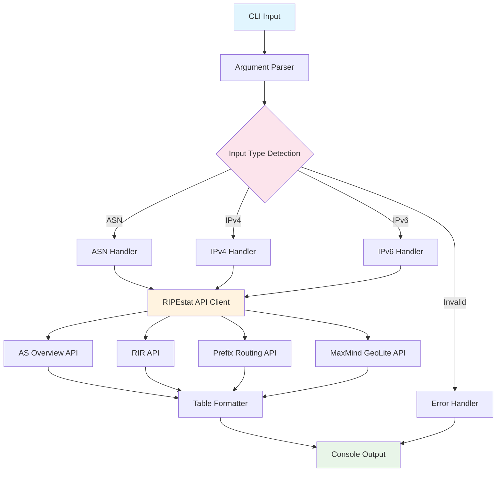

# Documentation

This directory contains documentation assets and resources for the ripestat-cli project.

## Structure

```
docs/
├── README.md           # This file - documentation index
└── images/             # Visual assets for documentation
    └── architecture.svg # System architecture diagram
```

## Images

### architecture.svg
- **Description**: System architecture diagram showing the flow from CLI input through API calls to formatted output
- **Format**: SVG (Scalable Vector Graphics)
- **Usage**: Used in both English and Chinese README files
- **Generated**: Created from Mermaid diagram using mermaid-cli

## Adding New Documentation Assets

When adding new documentation assets:

1. **Images**: Place in `docs/images/`
2. **Diagrams**: Use Mermaid format when possible, convert to SVG for inclusion
3. **Screenshots**: Use PNG format, optimize for web
4. **Videos**: Place in `docs/videos/` (create directory as needed)

## Diagram Source

The architecture diagram was generated from this Mermaid source:



To regenerate the diagram:
```bash
mmdc -i architecture.mmd -o docs/images/architecture.svg -t neutral -b white
```